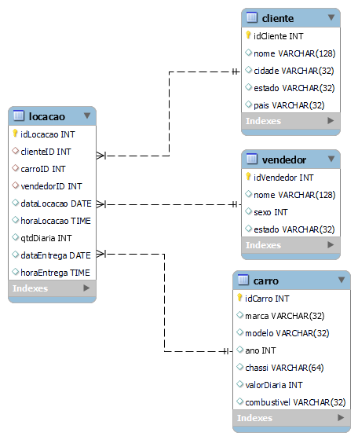
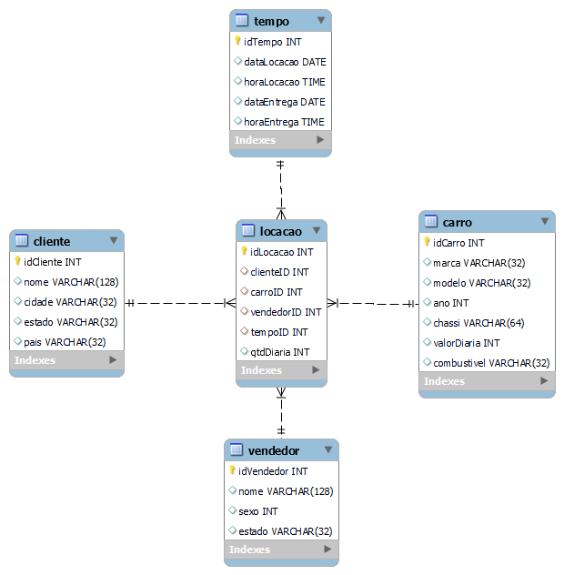

## Tarefa 1: Modelagem Relacional - Normalização

### Na Primeira forma Normal(1FN)

Não ouve alterações pois não tem atributos multivalorados, logo não precisou aplicar essa forma.

### Na Segunda forma Normal(2FN)

Que foi feito a separação das tabelas, pois os dados de cliente, vendedor e carro não tinha relação entre eles, e sim estava relacionados com a locacao somente.

### Na Terceira forma Normal(3FN)

Não foi precisa fazer nada, um caso nela seria o valor da diaria de um carro, caso o valor dele ficasse na tabela locacao, mas como coloquei na tabela carro, não precisou alterar.

---
Nessa parte de normalização para cumprir as 3 forma normal, acabou se criando 4 tabelas:
- carro
- cliente
- locacao
- vendedor

Alguns pontos a serem levantados nessa parte é que
- Sexo ficou como int, pois la ele era de forma 0 e 1, e não M/F ou Masculino/Feminino, e não tinha nada relacionando a isso.
- O idcombustivel foi retirado, pois observando o banco, vi que ele não era necessário, pois tem um campo com o nome do combustivel.

[Código aqui](relacional.sql)

A modelagem lógica após a normalização ficou assim:

## Tarefa 2: Modelagem Dimensional - Criação de Modelo

Nessa tarefa acabou criando 1 view para **fatos** que seria no caso da locação que carrega os id e as métricas próprias dela

E 3 views de **dimensões** que seria as outras tabelas, no caso 1 pra cliente, carro e funcionario.

[Código aqui](dimensional.sql)

A modelagem das views ficou assim:

